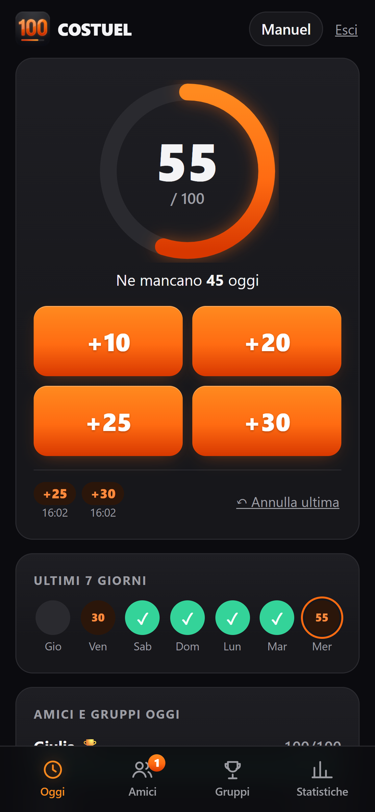
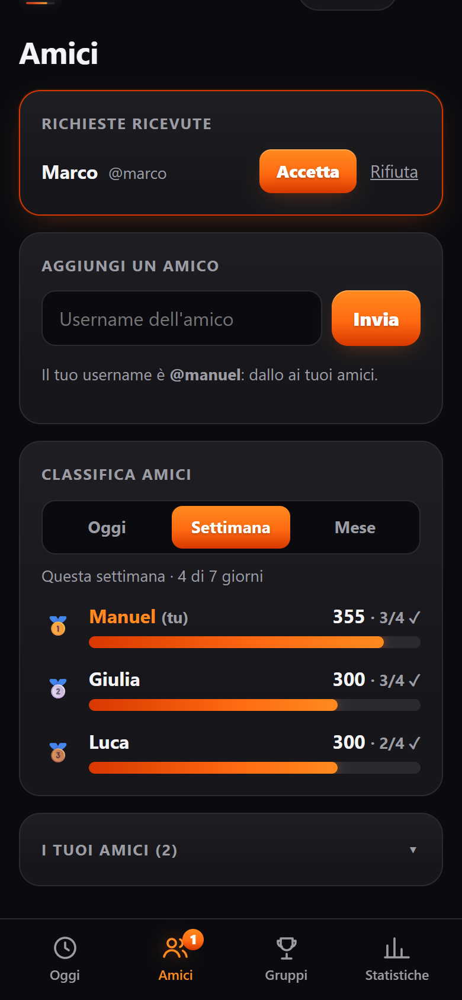
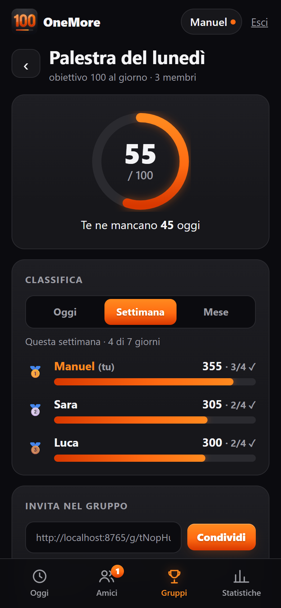
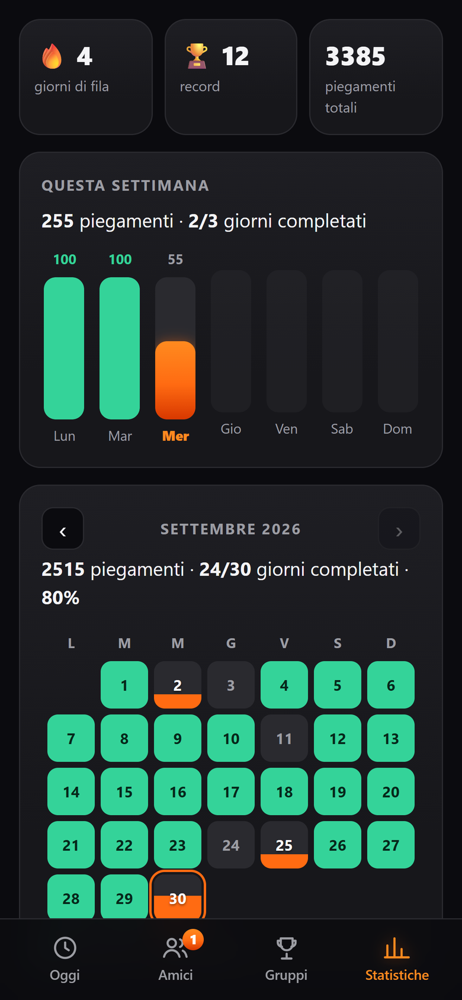
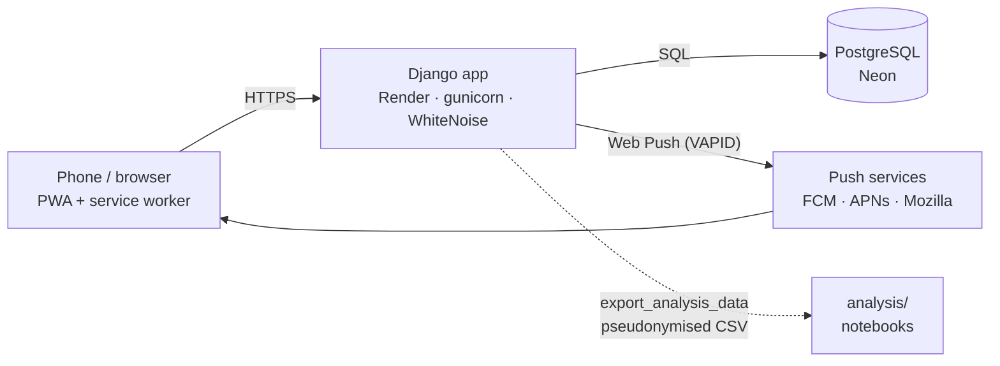

# OneMore 💪

[](https://github.com/manuelsambuco/OneMore/actions/workflows/tests.yml)
[](LICENSE)

**A 100-push-ups-a-day challenge app for friends, and a data-science project built on top of it.**

OneMore is an installable web app (PWA): log sets with one tap, see your friends' progress live,
get a push notification when they train, compete in groups with daily, weekly and monthly
leaderboards. The [`analysis/`](analysis/README.md) folder then studies the behaviour the app
produces: habit formation, a "will they make it today?" model, and a randomized experiment on
whether notifications actually cause people to train.

<table>
  <tr>
    <td align="center"><br><sub>Today</sub></td>
    <td align="center"><br><sub>Friends &amp; leaderboard</sub></td>
    <td align="center"><br><sub>Groups</sub></td>
    <td align="center"><br><sub>Statistics</sub></td>
  </tr>
</table>

<sub>The interface is in Italian: it was built for a real group of friends. Screenshots use demo data.</sub>

## Features

- **One-tap logging**: +10 / +20 / +25 / +30 buttons, undo last set. Reps beyond the daily goal
  are not counted (enforced server-side, safe against double taps).
- **Friends and groups**: friend requests by username; groups joined through a shareable invite
  link (the link also lets new users sign up without the invite code).
- **Group goals**: 100 stays the shared daily challenge, while each group sets its own daily goal
  (1 to 1000). With a higher goal (e.g. 200) members keep logging up to their highest group goal;
  friends still compare on 100 (extras shown as a "+50" badge) and each group ranks on its own goal.
- **Leaderboards** for today, this week and this month, for friends and for each group. Long lists
  stay short: top 10 (top 5 on the home page) plus your own position, the rest on demand.
- **Personal statistics**: current and best streak, weekly bar chart, monthly calendar.
- **Push notifications** to friends when you log a set or complete the challenge, also when the
  app is closed (Web Push with VAPID, via a service worker).
- **Installable** on Android and iOS as a PWA, dark theme, custom icon.
- **Built-in experiment**: every friend notification decision is logged and can be randomized
  (micro-randomized trial), see below.

## Data science

The [`analysis/`](analysis/README.md) package starts from a **simulator with a known ground
truth** that reproduces the app's mechanics, so every method is shown to recover the planted
effects before anything is claimed.

| Notebook | Question | Highlights |
|---|---|---|
| [01](analysis/notebooks/01_simulation_and_eda.ipynb) | What does the data look like? | Simulation design, EDA, user heterogeneity |
| [02](analysis/notebooks/02_streak_survival.ipynb) | How long do streaks last? Do they build habits? | Kaplan-Meier, Cox PH; a falling hazard is not proof of habit (selection) |
| [03](analysis/notebooks/03_completion_model.ipynb) | Will a user reach 100 today? | Time-split validation, calibrated gradient boosting with monotonic constraints, ROC AUC 0.94 |
| [04](analysis/notebooks/04_notification_effect.ipynb) | Do notifications cause more training? | Naive estimate confounded; micro-randomized trial recovers the truth; diminishing returns per notification |

The app runs the experiment of notebook 04 for real: `NOTIFY_DELIVERY_PROB` sets the share of
friend notifications delivered (1 by default, i.e. off), every decision is stored
(`NotificationEvent`), and `python manage.py export_analysis_data` exports pseudonymised data in
the same schema as the simulator, so the notebooks run unchanged on real usage.

## Architecture



- **Backend**: Python 3.12, Django 5.2, server-rendered templates; PostgreSQL in production,
  SQLite locally; all configuration from environment variables.
- **Frontend**: plain HTML/CSS and a small vanilla-JS layer (no framework): fetch-based updates,
  30-second polling of friends' progress, service worker for push, web app manifest.
- **Hosting**: free tiers only: Render (web service from `render.yaml`) and Neon (Postgres).
- **Analysis**: pandas, statsmodels, lifelines, scikit-learn, matplotlib.

### Design decisions worth a look

| Decision | Where |
|---|---|
| The daily cap is enforced in a transaction with a row lock, so concurrent taps can't exceed the goal | [`services.add_pushups`](challenge/services.py) |
| Each day stores a snapshot of the goal, so changing the goal never rewrites history or streaks | [`DailyLog.goal`](challenge/models.py) |
| Group goals are a dated history (admin changes apply from the next day), so weekly and monthly group leaderboards use the goal valid on each day | [`GroupGoalChange`](challenge/models.py), [`social.group_goals_by_day`](challenge/social.py) |
| A single function decides who sees whom (friends plus group members), used by leaderboards and notifications alike | [`social.challenge_members`](challenge/social.py) |
| Push is sent after the transaction commits, in a background thread; expired subscriptions are removed on 404/410 | [`push.py`](challenge/push.py) |
| Notification decisions are randomized and logged, with the recipient's active devices recorded *before* the draw | [`push.notify_progress`](challenge/push.py) |
| Post-signup redirects are validated against open redirects; invite links skip the signup code only for existing groups | [`views.signup`](challenge/views.py) |
| Exports use an HMAC of the user id as pseudonym; data exports and backups are git-ignored | [`export_analysis_data`](challenge/management/commands/export_analysis_data.py) |

## Repository layout

```
challenge/          the Django app: models, services, social graph, stats, push, views, templates, tests
config/             settings and URLs
analysis/           data-science package, notebooks and tests (own requirements)
docs/GUIDA.md       step-by-step operating guide in Italian (deploy, backups, changing the goal)
backup.py/.bat      one-click backup of the production database
render.yaml         Render blueprint
```

## Running locally

```bash
python -m venv .venv
.venv\Scripts\activate                 # macOS/Linux: source .venv/bin/activate
pip install -r requirements.txt
copy .env.example .env                 # macOS/Linux: cp .env.example .env
python manage.py genvapid              # paste the two VAPID_ lines into .env
python manage.py migrate
python manage.py runserver
```

Open http://localhost:8000 and sign up. Push notifications need HTTPS or `localhost`.

**Tests**: `python manage.py test challenge` (96 tests) and, for the analysis (after
`pip install -r analysis/requirements.txt`), `cd analysis && python -m pytest` (16 tests).
Both suites, plus a check that no migration is missing, run on every push with
[GitHub Actions](.github/workflows/tests.yml).

## Deployment

The repository is a Render blueprint: *New → Blueprint* on Render, then set the variables below.
The database is a free Neon Postgres (Render's free Postgres expires after 30 days).

| Variable | Purpose |
|---|---|
| `SECRET_KEY` | generated by Render |
| `DATABASE_URL` | Neon connection string (without pooling) |
| `VAPID_PUBLIC_KEY`, `VAPID_PRIVATE_KEY`, `VAPID_CONTACT` | Web Push keys (`python manage.py genvapid`) |
| `SIGNUP_CODE` | invite code required to sign up (empty = open registration) |
| `DEFAULT_DAILY_GOAL` | daily goal for new users and in the UI texts (default 100) |
| `NOTIFY_DELIVERY_PROB` | share of friend notifications delivered (default 1 = experiment off) |

Useful commands: `set_goal` (change the daily goal for everyone or one user, from today or tomorrow),
`export_analysis_data`, `genvapid`. The full step-by-step guide, including backups and restores,
is in [docs/GUIDA.md](docs/GUIDA.md) (Italian).

## About

Built for a real push-up challenge between friends. Developed with the help of
[Claude Code](https://claude.com/claude-code) as an AI pair programmer; commits are co-authored
accordingly.

Released under the [MIT License](LICENSE).
